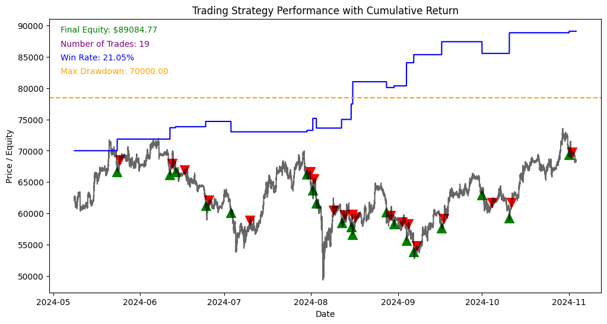

# HexaBotBacktest

# Hexabot - Cryptocurrency Backtesting Bot

Hexabot is a cryptocurrency trading bot designed to backtest various trading strategies using historical market data from Binance. This bot leverages technical indicators and provides detailed performance metrics for evaluating the effectiveness of trading strategies.

## Features

- Fetches historical market data from Binance.
- Computes various technical indicators including moving averages, Bollinger Bands, and RSI.
- Provides functionality to save data to an SQLite database for persistence.
- Executes backtesting with customizable parameters, including take-profit and stop-loss settings.
- Generates detailed reports on trading performance, including total return, annualized return, volatility, and more.
- Visualizes trading performance with equity curves and trade signals.

## Requirements

Before you begin, ensure you have met the following requirements:

- Python 3.11 or higher
- An active Binance account (API key required)
- SQLite (should be included with Python installations)
- Necessary Python packages (listed below)

### Required Python Packages

You can install the required packages using pip:

```bash
pip install ta numpy pandas matplotlib sqlalchemy binance tabulate
```

### Display live Output 


Singal backtest for specific parameters output :


### Plots:
Visualizing Results
The bot will generate plots of trading performance, showing:

Close price
Buy and sell signals
Equity curve
Final equity and number of trades
You can further customize the plotting method to include additional metrics.




### Clone the Repository
First, clone the repository to your local machine:

```bash
git clone https://github.com/CVRpy/HexaBotBacktest.git
cd hexabot
```

### Configuration
Set Up Binance API Keys: You will need to create a Binance API key and secret to access market data. Add your API credentials in the DataSQL class or configure it accordingly in the code.

Modify Parameters: Before running the bot, modify the parameters in the code:

symbol: The trading pair you want to backtest (e.g., BTCUSDT).
interval: The time interval for the historical data (e.g., 1h, 4h, 1d).
start: Start date for fetching historical data (e.g., 1 Jan, 2022).
end: End date for fetching historical data (e.g., 1 Jan, 2023).

Usage
To run the bot and execute a backtest, create an instance of the Backtest class in your main script:
```bash
from your_module import Backtest

# Set up parameters
cash = 1000  # Initial cash amount
fees = 0.001  # Trading fees as a decimal (0.1% in this case)

# Initialize backtest instance with desired parameters
backtest = Backtest(cash, fees, symbol='BTCUSDT', interval='1h', start='1 Jan, 2022', end='1 Jan, 2023', tp=0.03, sl=0.02)

# Execute backtest
backtest.run()  # Assuming there is a run method to execute the backtest
```

### Database Management
Hexabot saves historical data to an SQLite database (live_crypto.db). You can query this database to analyze past data or use it for further analysis.

To view available tables, use the SqlReader class:

```bash
from your_module import SqlReader

sql_reader = SqlReader()
tables = sql_reader.get_tables()
print(tables)
```

### Author
Hexabot was developed by Rami Sayed. Feel free to reach out for collaboration or inquiries.